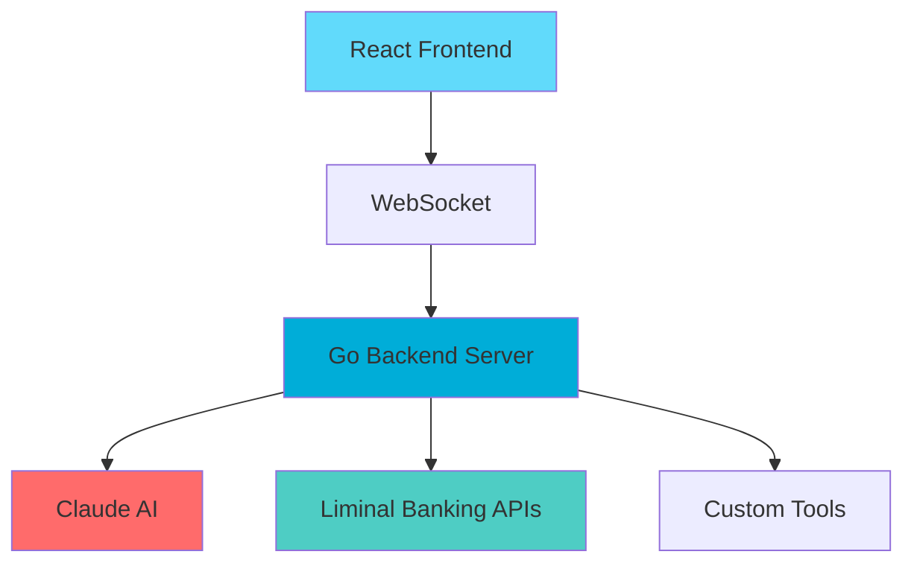

# 🤖 AI Financial Agent

**Next-generation financial assistant powered by Claude AI and real banking APIs**

<div align="center">


[Quick Start](#-5-minute-quickstart) • [Features](#-features) • [API](#-available-tools) • [Examples](#-example-queries) • [Hackathon](#-hackathon-project-ideas)

</div>

---

## 🎯 Overview

This project creates a sophisticated AI financial agent that can handle real banking operations through natural conversation. Built with Go backend and React frontend, it combines the power of Claude AI with Liminal's stablecoin banking platform to deliver an intelligent, conversational financial assistant.

### ✨ What Makes It Special

- 🧠 **AI-Powered**: Natural language understanding with Claude AI
- 💰 **Real Banking**: Live operations via Liminal stablecoin platform  
- 💬 **Conversational Interface**: Beautiful chat widget with real-time responses
- 🔧 **Extensible**: Easy to add custom financial tools and analytics
- 🛡️ **Secure**: JWT-based authentication, no API key exposure
- ⚡ **Real-time**: WebSocket connections for instant communication

---

## 🚀 5-Minute Quickstart

### Prerequisites
- **Go 1.21+** 
- **Node.js 18+**
- **Anthropic API key**

### Setup

```bash
# Clone and configure
git clone https://github.com/becomeliminal/nim-go-sdk.git
cd nim-go-sdk/examples/hackathon-starter
cp .env.example .env

# Add your Anthropic key to .env
echo "ANTHROPIC_API_KEY=sk-ant-your-key-here" >> .env

# Start backend
go mod tidy && go run main.go

# Start frontend (new terminal)
cd frontend && npm install && npm run dev
```

Visit `http://localhost:5173` → Click chat bubble → Login with email → Start chatting!

---

## 💎 Features

### 🏦 Core Banking Operations
| Operation | Description | Example |
|-----------|-------------|---------|
| **Balance Check** | View wallet & savings balances | "What's my balance?" |
| **Transaction History** | Browse recent transactions | "Show my last 10 transactions" |
| **Money Transfers** | Send/receive funds with confirmation | "Send $50 to @alice" |
| **Savings Management** | Deposit/withdraw from savings | "Move $100 to savings" |
| **User Search** | Find users by display tag | "Search for @bob" |

### 🧠 Intelligent Analytics
- **Spending Analysis** - Pattern recognition and insights
- **Subscription Detection** - Auto-identify recurring payments
- **Budget Tracking** - Monitor spending against limits
- **Financial Health Scoring** - Overall wellness assessment

### 🎨 User Experience
- **Natural Conversation** - Chat like you would with a financial advisor
- **Smart Confirmations** - Clear summaries before money movements
- **Real-time Updates** - Instant WebSocket responses
- **Mobile Responsive** - Works beautifully on all devices

---

## 🛠️ Architecture



### Tech Stack
- **Backend**: Go 1.21+ with `nim-go-sdk`
- **Frontend**: React 18 + TypeScript + Vite
- **AI**: Claude via Anthropic API
- **Banking**: Liminal stablecoin APIs
- **Real-time**: WebSocket communication
- **Styling**: Tailwind CSS

---

## 🔧 Available Tools

### 📊 Read Operations (Instant)
```go
get_balance()           // Wallet balance
get_savings_balance()    // Savings positions & APY
get_transactions()       // Transaction history
get_profile()           // User profile
search_users()          // Find users by tag
get_vault_rates()       // Current interest rates
```

### 💸 Write Operations (Confirmation Required)
```go
send_money()            // Send funds to users
deposit_savings()       // Add to savings
withdraw_savings()      // Remove from savings
```

### 🤖 Custom Analytics Tools
```go
analyze_spending()      // Spending pattern analysis
analyze_subscriptions() // Recurring payment detection
```

---

## 💡 Example Queries

### 💰 Basic Banking
> "What's my current balance?"  
> "How much do I have in savings?"  
> "Show me transactions from last week"

### 📊 Analytics & Insights  
> "Analyze my spending patterns over the last 30 days"  
> "What subscriptions am I paying for?"  
> "What's my average daily spending?"

### 💸 Money Management
> "Send $25 to @john for coffee"  
> "Move $200 from savings to wallet"  
> "Put $500 into high-yield savings"

### 🎯 Smart Assistant
> "Am I on track with my budget?"  
> "Should I save more this month?"  
> "What's my financial health score?"

---

## 🏆 Hackathon Project Ideas

### 🌟 Beginner Friendly
1. **Savings Goal Tracker** - Track progress toward financial goals
2. **Spending Categorizer** - Auto-categorize transactions 
3. **Bill Reminder System** - Alert before recurring payments

### 🚀 Intermediate
4. **Cash Flow Forecaster** - Predict future balances
5. **Budget Optimization** - Suggest spending improvements
6. **Investment Advisor** - Recommend savings strategies

### 🏆 Advanced
7. **AI Budget Coach** - Learn patterns and provide personalized advice
8. **Tax Estimation Tool** - Calculate tax obligations
9. **Peer Comparison System** - Anonymous financial benchmarking

---

## 🎨 Adding Custom Tools

Create powerful financial tools with just a few lines of Go:

```go
func createBudgetTrackerTool(liminalExecutor core.ToolExecutor) core.Tool {
    return tools.New("track_budget").
        Description("Track spending against budget limits").
        Schema(tools.ObjectSchema(map[string]interface{}{
            "category": tools.StringProperty("Budget category"),
            "limit": tools.NumberProperty("Budget limit"),
        })).
        Handler(func(ctx context.Context, toolParams *core.ToolParams) (*core.ToolResult, error) {
            // Your custom logic here
            return &core.ToolResult{Success: true, Data: insights}, nil
        }).
        Build()
}
```

Add to server with `srv.AddTool(createBudgetTrackerTool(liminalExecutor))`

---

## 🐛 Troubleshooting

### Common Issues
- **Backend won't start**: Check `ANTHROPIC_API_KEY` in `.env`
- **WebSocket connection fails**: Ensure backend running on port 8080
- **Liminal login issues**: Check email for OTP code (including spam)
- **Module not found**: Run `npm install` in frontend directory

### Quick Fixes
```bash
# Reset everything
pkill -f "go run main.go"  # Kill backend
cd frontend && rm -rf node_modules package-lock.json  # Clean frontend
npm install  # Reinstall frontend deps
go mod tidy  # Clean Go deps
go run main.go  # Restart backend
```

---

## 📚 Resources

### Documentation
- [nim-go-sdk GitHub](https://github.com/becomeliminal/nim-go-sdk)
- [Liminal Platform](https://liminal.cash)
- [Anthropic Claude API](https://docs.anthropic.com/)
- [React Documentation](https://react.dev)

## 📄 License

MIT License - see [LICENSE](../../LICENSE) for details.

---

<div align="center">

**Built with 💜 for the Liminal Vibe Banking Hackathon**

[🚀 Get Started](#-5-minute-quickstart) • [💡 Ideas](#-hackathon-project-ideas) • [📖 Docs](#-resources) • [🐛 Help](#-troubleshooting)
